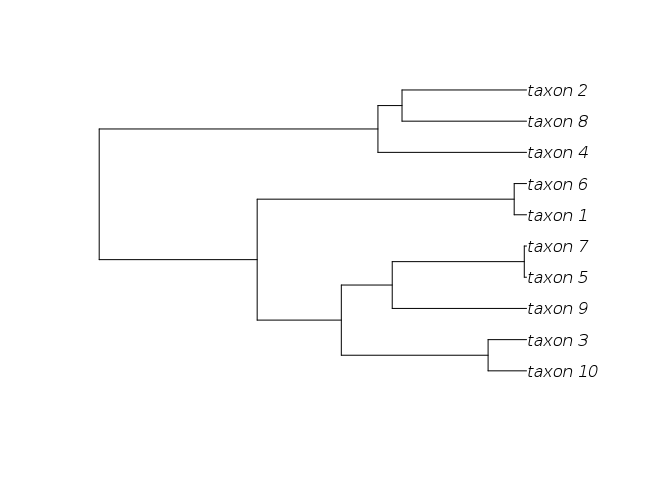

<!-- README.md is generated from README.Rmd. Please edit that file -->
[](http://dx.doi.org/10.5281/zenodo.13131) [](https://travis-ci.org/ropensci/RNeXML)

RNeXML: The next-generation phylogenetics format comes to R
===========================================================

-   Maintainer: Carl Boettiger
-   Authors: Carl Boettiger, Scott Chamberlain, Hilmar Lapp, Kseniia Shumelchyk, Rutger Vos
-   License: BSD-3
-   [Issues](https://github.com/ropensci/RNeXML/issues): Bug reports, feature requests, and development discussion.

An extensive and rapidly growing collection of richly annotated phylogenetics data is now available in the NeXML format. NeXML relies on state-of-the-art data exchange technology to provide a format that can be both validated and extended, providing a data quality assurance and adaptability to the future that is lacking in other formats. See [Vos et al 2012](http://doi.org/10.1093/sysbio/sys025 "NeXML: Rich, Extensible, and Verifiable Representation of Comparative Data and Metadata.") for further details on the NeXML format.

How to cite
-----------

RNeXML has been published in the following article:

> Boettiger C, Chamberlain S, Vos R and Lapp H (2016). “RNeXML: A Package for Reading and Writing Richly Annotated Phylogenetic, Character, and Trait Data in R.” *Methods in Ecology and Evolution*, **7**, pp. 352-357. [doi:10.1111/2041-210X.12469](http://doi.org/10.1111/2041-210X.12469)

Although the published version of the article is paywalled, the source of the manuscript, and a much better rendered PDF, are included in this package (in the `manuscripts` folder). You can also find it [freely available on arXiv](http://arxiv.org/abs/1506.02722).

Getting Started
---------------

The latest stable release of RNeXML is on CRAN, and can be installed with the usual `install.packages("RNeXML")` command. Some of the more specialized functionality described in the Vignettes (such as RDF manipulation) requires additional packages which can be installed using:

``` r
install.packages("RNeXML", deps=TRUE, repos=c("https://cran.rstudio.com", "http://packages.ropensci.org"))
```

which will also install the development version of the RNeXML package. For most common tasks such as shown here, those additional packages are not required. The development version of RNeXML is also [available on Github](https://github.com/ropensci/RNeXML). With the `devtools` package installed on your system, RNeXML can be installed using:

``` r
library(devtools)
install_github("ropensci/RNeXML")
library(RNeXML)
```

Read in a `nexml` file into the `ape::phylo` format:

``` r
f <- system.file("examples", "comp_analysis.xml", package="RNeXML")
nexml <- nexml_read(f)
tr <- get_trees(nexml) # or: as(nexml, "phylo")
plot(tr)
```



Write an `ape::phylo` tree into the `nexml` format:

``` r
data(bird.orders)
nexml_write(bird.orders, "test.xml")
#> [1] "test.xml"
```

A key feature of NeXML is the ability to formally validate the construction of the data file against the standard (the lack of such a feature in nexus files had lead to inconsistencies across different software platforms, and some files that cannot be read at all). While it is difficult to make an invalid NeXML file from `RNeXML`, it never hurts to validate just to be sure:

``` r
nexml_validate("test.xml")
#> [1] TRUE
```

Extract metadata from the NeXML file:

``` r
birds <- nexml_read("test.xml")
get_taxa(birds)
#>     otu            label about xsi.type otus
#> 1  ou70 Struthioniformes #ou70       NA  os4
#> 2  ou71     Tinamiformes #ou71       NA  os4
#> 3  ou72      Craciformes #ou72       NA  os4
#> 4  ou73      Galliformes #ou73       NA  os4
#> 5  ou74     Anseriformes #ou74       NA  os4
#> 6  ou75    Turniciformes #ou75       NA  os4
#> 7  ou76       Piciformes #ou76       NA  os4
#> 8  ou77    Galbuliformes #ou77       NA  os4
#> 9  ou78   Bucerotiformes #ou78       NA  os4
#> 10 ou79      Upupiformes #ou79       NA  os4
#> 11 ou80    Trogoniformes #ou80       NA  os4
#> 12 ou81    Coraciiformes #ou81       NA  os4
#> 13 ou82      Coliiformes #ou82       NA  os4
#> 14 ou83     Cuculiformes #ou83       NA  os4
#> 15 ou84   Psittaciformes #ou84       NA  os4
#> 16 ou85      Apodiformes #ou85       NA  os4
#> 17 ou86   Trochiliformes #ou86       NA  os4
#> 18 ou87  Musophagiformes #ou87       NA  os4
#> 19 ou88     Strigiformes #ou88       NA  os4
#> 20 ou89    Columbiformes #ou89       NA  os4
#> 21 ou90       Gruiformes #ou90       NA  os4
#> 22 ou91    Ciconiiformes #ou91       NA  os4
#> 23 ou92    Passeriformes #ou92       NA  os4
get_metadata(birds) 
#>   LiteralMeta                      property   datatype content
#> 1         m15                    dc:creator xsd:string        
#> 2        <NA>                          <NA>       <NA>    <NA>
#> 3         m17 dcterms:bibliographicCitation xsd:string    <NA>
#>       xsi.type ResourceMeta        rel
#> 1  LiteralMeta         <NA>       <NA>
#> 2 ResourceMeta          m16 cc:license
#> 3  LiteralMeta         <NA>       <NA>
#>                                                href
#> 1                                              <NA>
#> 2 http://creativecommons.org/publicdomain/zero/1.0/
#> 3                                              <NA>
```

------------------------------------------------------------------------

Add basic additional metadata:

``` r
  nexml_write(bird.orders, file="meta_example.xml",
              title = "My test title",
              description = "A description of my test",
              creator = "Carl Boettiger <cboettig@gmail.com>",
              publisher = "unpublished data",
              pubdate = "2012-04-01")
#> [1] "meta_example.xml"
```

By default, `RNeXML` adds certain metadata, including the NCBI taxon id numbers for all named taxa. This acts a check on the spelling and definitions of the taxa as well as providing a link to additional metadata about each taxonomic unit described in the dataset.

### Advanced annotation

We can also add arbitrary metadata to a NeXML tree by define `meta` objects:

``` r
modified <- meta(property = "prism:modificationDate",
                 content = "2013-10-04")
```

Advanced use requires specifying the namespace used. Metadata follows the RDFa conventions. Here we indicate the modification date using the prism vocabulary. This namespace is included by default, as it is used for some of the basic metadata shown in the previous example. We can see from this list:

``` r
RNeXML:::nexml_namespaces
#>                                              nex 
#>                      "http://www.nexml.org/2009" 
#>                                              xsi 
#>      "http://www.w3.org/2001/XMLSchema-instance" 
#>                                              xml 
#>           "http://www.w3.org/XML/1998/namespace" 
#>                                             cdao 
#>        "http://purl.obolibrary.org/obo/cdao.owl" 
#>                                              xsd 
#>              "http://www.w3.org/2001/XMLSchema#" 
#>                                               dc 
#>               "http://purl.org/dc/elements/1.1/" 
#>                                          dcterms 
#>                      "http://purl.org/dc/terms/" 
#>                                              ter 
#>                      "http://purl.org/dc/terms/" 
#>                                            prism 
#> "http://prismstandard.org/namespaces/1.2/basic/" 
#>                                               cc 
#>                 "http://creativecommons.org/ns#" 
#>                                             ncbi 
#>          "http://www.ncbi.nlm.nih.gov/taxonomy#" 
#>                                               tc 
#>  "http://rs.tdwg.org/ontology/voc/TaxonConcept#"
```

This next block defines a resource (link), described by the `rel` attribute as a homepage, a term in the `foaf` vocabulalry. Becuase `foaf` is not a default namespace, we will have to provide its URL in the full definition below.

``` r
website <- meta(href = "http://carlboettiger.info", 
                rel = "foaf:homepage")
```

Here we create a history node using the `skos` namespace. We can also add id values to any metadata element to make the element easier to reference externally:

``` r
  history <- meta(property = "skos:historyNote", 
                  content = "Mapped from the bird.orders data in the ape package using RNeXML",
                  id = "meta123")
```

For this kind of richer annotation, it is best to build up our NeXML object sequentially. Frist we will add `bird.orders` phylogeny to a new phylogenetic object, and then we will add the metadata elements created above to this object. Finally, we will write the object out as an XML file:

``` r
  birds <- add_trees(bird.orders)
  birds <- add_meta(meta = list(history, modified, website),
                    namespaces = c(skos = "http://www.w3.org/2004/02/skos/core#",
                                   foaf = "http://xmlns.com/foaf/0.1/"),
                    nexml=birds)
  nexml_write(birds, 
              file = "example.xml")
#> [1] "example.xml"
```

### Taxonomic identifiers

Add taxonomic identifier metadata to the OTU elements: <!-- This block relies on a robust internet connection that can occassionally fail.  Also it's a bit slow, so don't run it. After all, this command is tested in the unit tests.-->

``` r
nex <- add_trees(bird.orders)
nex <- taxize_nexml(nex)
```

Working with character data
---------------------------

NeXML also provides a standard exchange format for handling character data. The R platform is particularly popular in the context of phylogenetic comparative methods, which consider both a given phylogeny and a set of traits. NeXML provides an ideal tool for handling this metadata.

### Extracting character data

We can load the library, parse the NeXML file and extract both the characters and the phylogeny.

``` r
library(RNeXML)
nexml <- read.nexml(system.file("examples", "comp_analysis.xml", package="RNeXML"))
traits <- get_characters(nexml)
tree <- get_trees(nexml)
```

(Note that `get_characters` would return both discrete and continuous characters together in the same data.frame, but we use `get_characters_list` to get separate data.frames for the continuous `characters` block and the discrete `characters` block).

We can then fire up `geiger` and fit, say, a Brownian motion model the continuous data and a Markov transition matrix to the discrete states:

``` r
library(geiger)
fitContinuous(tree, traits[1], ncores=1)
#> GEIGER-fitted comparative model of continuous data
#>  fitted 'BM' model parameters:
#>  sigsq = 1.166011
#>  z0 = 0.255591
#> 
#>  model summary:
#>  log-likelihood = -20.501183
#>  AIC = 45.002367
#>  AICc = 46.716652
#>  free parameters = 2
#> 
#> Convergence diagnostics:
#>  optimization iterations = 100
#>  failed iterations = 0
#>  frequency of best fit = 1.00
#> 
#>  object summary:
#>  'lik' -- likelihood function
#>  'bnd' -- bounds for likelihood search
#>  'res' -- optimization iteration summary
#>  'opt' -- maximum likelihood parameter estimates
fitDiscrete(tree, traits[2], ncores=1)
#> GEIGER-fitted comparative model of discrete data
#>  fitted Q matrix:
#>                 0           1
#>     0 -0.07308302  0.07308302
#>     1  0.07308302 -0.07308302
#> 
#>  model summary:
#>  log-likelihood = -4.574133
#>  AIC = 11.148266
#>  AICc = 11.648266
#>  free parameters = 1
#> 
#> Convergence diagnostics:
#>  optimization iterations = 100
#>  failed iterations = 0
#>  frequency of best fit = 1.00
#> 
#>  object summary:
#>  'lik' -- likelihood function
#>  'bnd' -- bounds for likelihood search
#>  'res' -- optimization iteration summary
#>  'opt' -- maximum likelihood parameter estimates
```

------------------------------------------------------------------------

[](http://ropensci.org)
